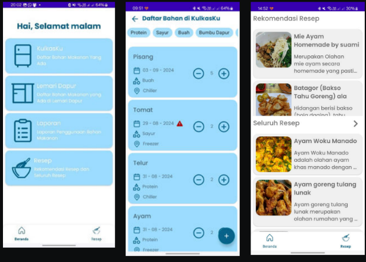

# KuPin - Kulkas Pintar

**KuPin** adalah aplikasi Android pintar yang membantu pengguna mengelola bahan makanan di rumah sekaligus merekomendasikan resep masakan berdasarkan bahan yang tersedia. Dengan KuPin, pengguna tidak hanya bisa mencatat bahan makanan di kulkas dan dapur, tetapi juga mendapatkan notifikasi saat bahan mendekati masa kedaluwarsa, serta menemukan berbagai resep yang relevan.

## Fitur Utama

- 📦 **Pencatatan Bahan Makanan:** Simpan daftar bahan makanan yang tersedia di kulkas dan lemari dapur.
- 🍽️ **Rekomendasi Resep Otomatis:** Aplikasi akan merekomendasikan resep berdasarkan bahan yang tersedia.
- ⏰ **Notifikasi Kadaluwarsa:** Dapatkan pengingat sebelum bahan makanan kadaluwarsa agar tidak terbuang.
- 📖 **Eksplorasi Resep:** Jelajahi berbagai resep masakan untuk referensi memasak harian.
- 📊 **Laporan Penggunaan Bahan:** Menampilkan laporan penggunaan bahan makanan yang telah digunakan untuk memasak.

## Teknologi yang Digunakan

- **Bahasa Pemrograman:** Kotlin
- **Platform:** Android
- **Model Rekomendasi:** Menggunakan API eksternal untuk menghasilkan rekomendasi resep berdasarkan bahan.

## Cara Menjalankan Proyek

1. **Clone repositori ini:**
   ```bash
   git clone https://github.com/nama-kamu/kupin-kulkas-pintar.git
   cd kupin-kulkas-pintar

## Tampilan Aplikasi



